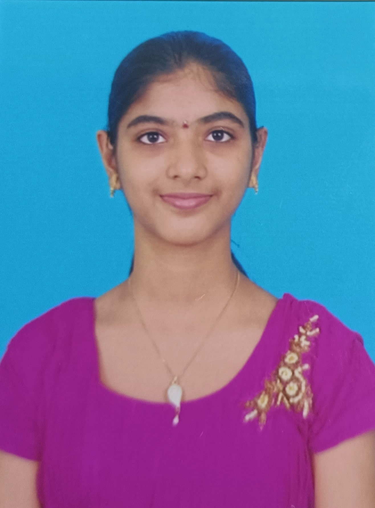

   Yamini Priya | IIT Goa
 
 * [About me](aboutme)
 * [Education](#education)
 * [Course @IIT Goa](course@iitgoa)
 * [Hobbies & Interests](hobbies&interests)
 
 # About me
 ----------

 1. My name is K.Yamini Priya.
 2. I am a student in the School of Mathematics and Computer Science at **IIT Goa**.
 3. I am currently pursuing BTech __1st Year__.
 4. I am working as an **marketing associate** in the technical field at IIT Goa.
 5. I am also one of the member of Varaha,Climate Community.Currently working on a project called **Rainwater Harvesting**.

## Education
------------

| Academic Year | Standard | School/College Name    |
| ------------- | -------- | -------------------    |
| 2009-2012     | LKG-2nd  | Vikas Academy          | 
| 2012-2016     | 3rd-6th  | Keshava Reddy School   |  
| 2016-2020     | 7th-10th | Narayana E.M School    |
| 2020-2022     | 11th-12th|Narayana Narmada College|

## Course @IIT Goa
------------------

*  **MA103**   Ordinary differential equations  *Dr. Saumya Bajpai*       
*  **BIO101**  Introductory Biology  *Dr. Sreenath Balakrishnan*,*Dr. Nipa Chongdar*       
*  **ME102**   Engineering Graphics and Introduction to Computer -Aided-Drawing  *Dr. Arindam Das*          
*  **NO102**   National Sports Organisation  *Unspecified*         
*  **PH102**   Electricity and Magnetism   *Dr. Santosh Kumar*,*Dr. Vaibhav Wasnik*            
*  **EE101**   Introduction to Electrical and Electronics Engineering  *Dr. Bidhan Pramanick*,*Dr. Apeksha Madhukar*          
*  **CS102**   Software Tools  *Dr.Clint Pazhayidam George*          
*  **PH103**   Physics Lab  *Dr. Santosh Kumar Das*,*Dr. Sudipta Kanungo*,*Dr. Santosh Kumar*,*Dr. Vaibhav Wasnik*,*Dr. Jhuma Sannigrahi*          
*  **MA102**   Basic Linear Algebra  *Dr. KALPESH HARIA*

## Hobbies & Interests
----------------------

My hobbies are listening music and drawing.Also I am a nature lover.I am interested in coding,cyber security and hacking.
   
  
  

